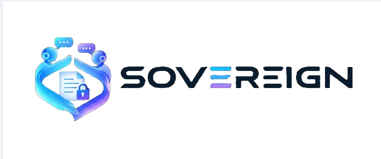
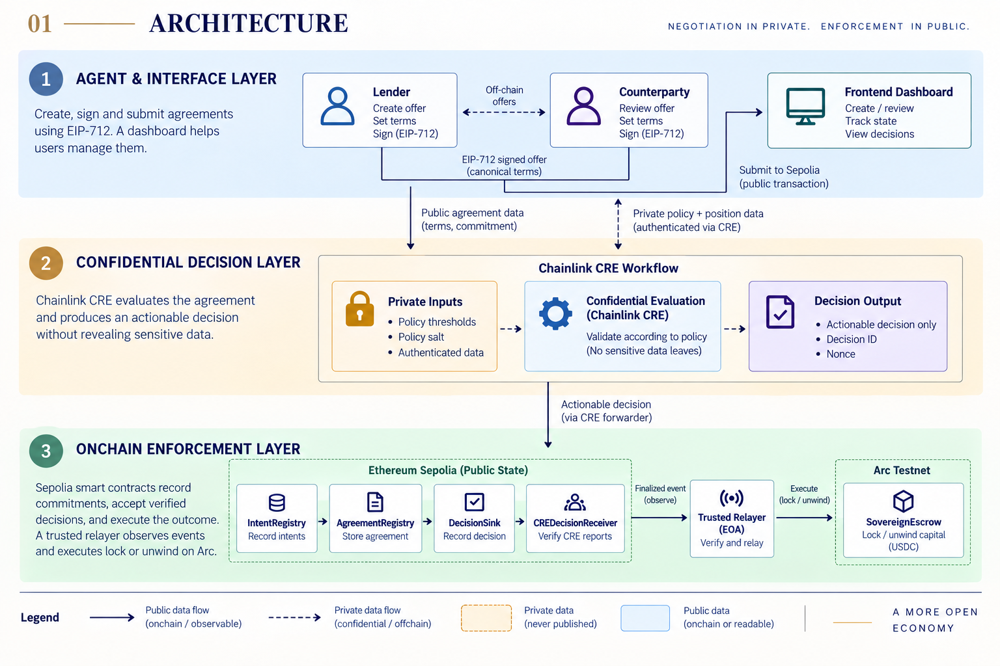
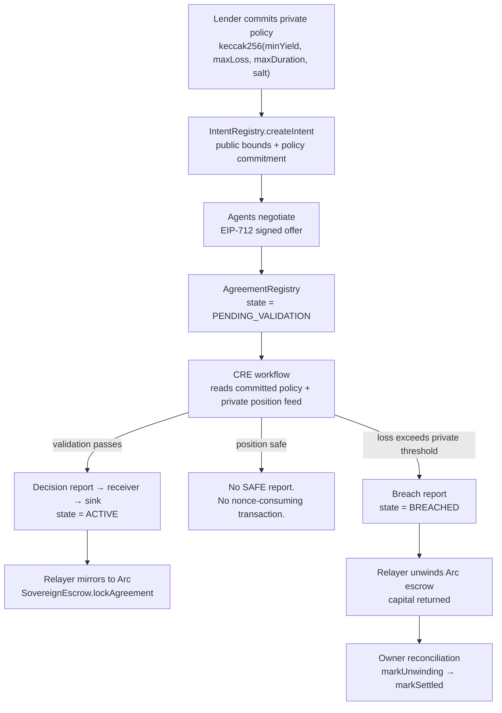
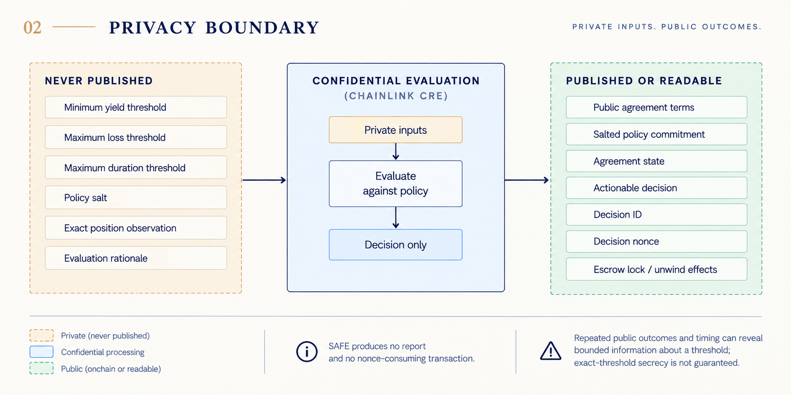
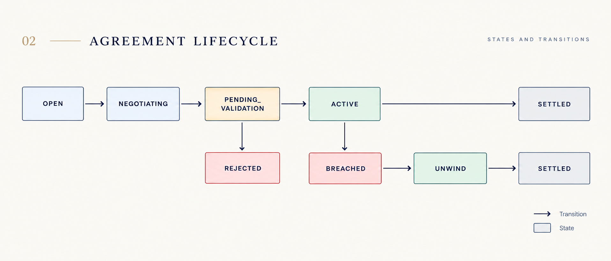
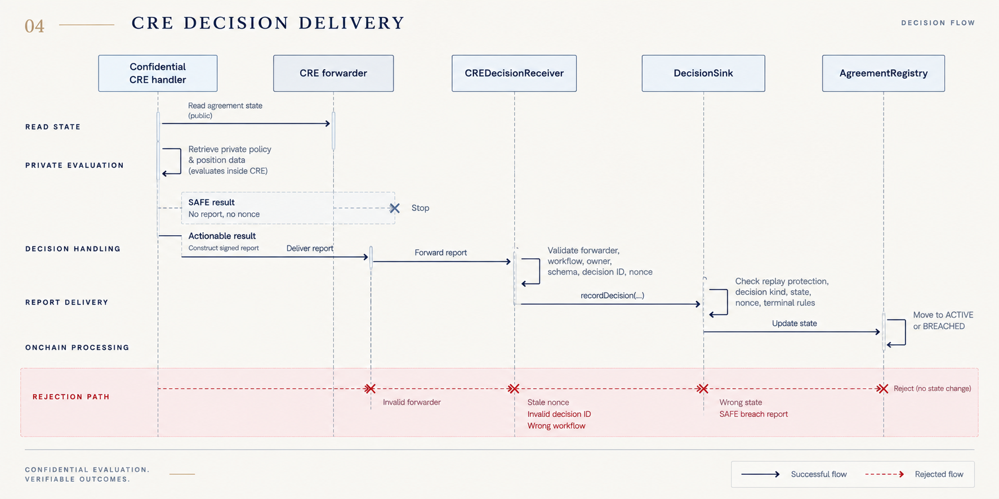
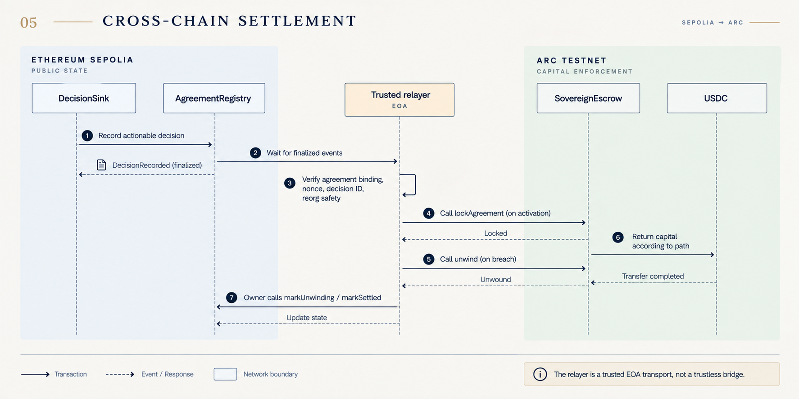
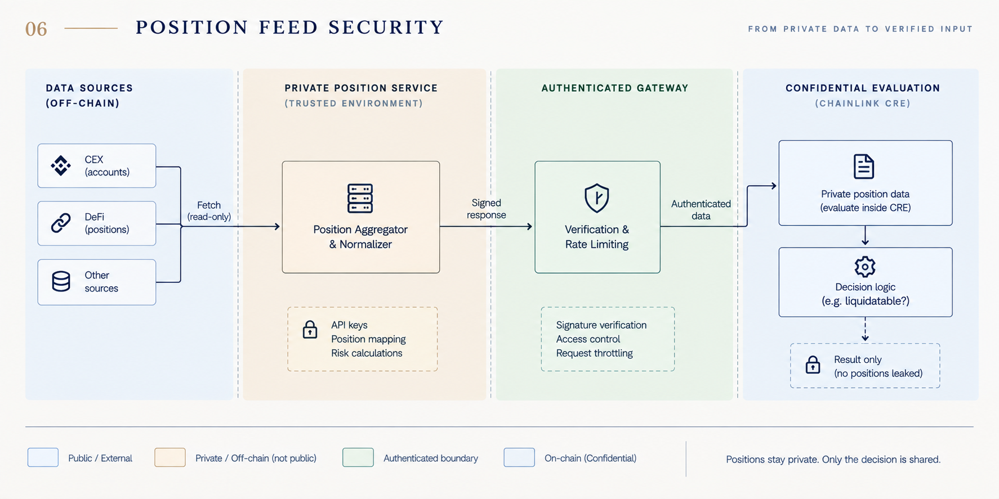

# Sovereign

<p align="center">
  
</p>

**Private risk policies, enforced onchain, without revealing the policy.**

Two parties negotiate a capital agreement. The lender has a private risk policy —
minimum yield, maximum tolerable loss, maximum duration — that they do not want
to publish, because publishing it tells every counterparty exactly how to price
against them. Sovereign lets that policy be enforced anyway.

The policy is committed onchain as a salted hash. A confidential Chainlink CRE
workflow reads the committed policy and authenticated private position data,
evaluates them inside the workflow, and publishes **only a decision** — never the
inputs. A safe position produces no transaction at all. A breach produces a
signed report that unwinds escrow on a second chain.

## What this repository proves

A single agreement completed the entire lifecycle across two public testnets,
finalized and independently verifiable:

| Step | Chain | Block | Transaction |
| --- | --- | --- | --- |
| Validation accepted → `ACTIVE` | Sepolia | 11676619 | `0x780399f2021a73c88262c51d828935475db79e188889f0b97ee746f3932adaa6` |
| Breach accepted → `BREACHED` | Sepolia | 11676674 | `0xe2d5de804e294716501baf7ee73203c05fd12ad041ca757275262cdd5c938626` |
| Escrow locked | Arc | 61511320 | `0xa451e043238c539d736195dabbbe03c687955f5d6de98aa26b53a89845864722` |
| Escrow unwound | Arc | 61511443 | `0x80925167aa3639108fec481f670c2da04aed92dde2f33a0baeb7922a65cb3313` |
| Owner `markUnwinding` | Sepolia | 11679683 | `0x22dd525f767a07622356124d781b208552db8c9f240d35175e38288bb469ca86` |
| Owner `markSettled` → `SETTLED` | Sepolia | 11679756 | `0x7730aabb7cca24db053467a779b346f67de791906c29ea93379737b8cce161b1` |

Agreement `0x08aea1ace117f14f97f852be19c3a68ad07a43be6b42099a24bba64a27ae389b`.
Final state: Sepolia `SETTLED`, Arc `UNWOUND`, capital returned in full.
Full record under the `rehearsal` key in [`deployments/canonical.json`](deployments/canonical.json).

Throughout that run the policy thresholds were never published, and the safe
observations that preceded the breach produced no SAFE decision, report, or
nonce-consuming transaction. Timing, public observations, and later enforcement
effects can still reveal bounded information; this is not a claim of perfect
threshold secrecy.

**Scope of the claim.** This is real deployment, real wiring, real transactions
and real state transitions on two public testnets, driven through the Chainlink
CRE CLI mock forwarder. It is not a production attestation and not hardware
enclave execution. See [security boundaries](#security-boundaries-and-honest-limitations).

## How it works

### Architecture

<p align="center">
  
</p>

_Figure 1. Sovereign separates negotiation, confidential evaluation, and onchain enforcement. Solid arrows represent public data flow; dashed arrows represent private or confidential data flow._



The privacy property comes from three choices working together:

<p align="center">
  
</p>

_Figure 2. Sovereign publishes commitments, decisions, and enforcement effects while keeping policy thresholds, salts, exact observations, and evaluation rationale private._

1. **Salted commitment.** Thresholds are small integers, so an unsalted hash
   would be trivially enumerable. A 32-byte salt prevents that.
2. **Decision-only publication.** The workflow emits a decision, never the
   policy or the position reading that produced it.
3. **Silent SAFE.** A non-breach evaluation produces no report and consumes no
   nonce, so the absence of a transaction leaks less than a "still safe" message
   would. This is enforced twice: sender-side before report generation, and
   contract-side as `NonActionableDecision`.

### The enforced path, step by step

### Agreement lifecycle

<p align="center">
  
</p>

_Figure 3. The agreement state machine, including rejection and the breach-to-unwind settlement path._

**Agreement creation.** A principal creates an intent through `IntentRegistry`
carrying public bounds plus the policy commitment. A signed seven-field canonical
offer is proposed through `AgreementRegistry`, which binds terms, participants,
capital, expiry and nonce, then moves the agreement to `PENDING_VALIDATION`.

**Confidential evaluation.** The workflow reads public agreement state and
authenticated position data. Private policy values and the salt are retrieved
only inside the handler. Ordinary rejection and commitment failure return the
same public result, so a failed match reveals nothing extra.

**Decision delivery.** An actionable decision becomes a report delivered to
`CREDecisionReceiver`, which checks the forwarder, workflow identity, owner,
report schema, derived decision ID and nonce before calling `DecisionSink`. The
sink then applies replay, state, decision-kind and terminal-state guards.

<p align="center">
  
</p>

_Figure 4. SAFE evaluation stops without a report or nonce; actionable reports pass through receiver and sink validation before an agreement state can change._

**Cross-chain settlement.** The relayer reads *finalized* Sepolia
`DecisionRecorded` events, verifies agreement binding, nonce, decision ID and
reorg safety, then locks or unwinds Arc escrow. Owner reconciliation separately
advances the Sepolia registry from `UNWIND` to `SETTLED`. The relayer is an
explicitly trusted EOA transport, not a trustless bridge.

<p align="center">
  
</p>

_Figure 5. The trusted relayer waits for finalized Sepolia evidence, verifies decision binding and reorg safety, and then locks or unwinds Arc escrow._

**Position-feed boundary.** The feed stores only scoped token hashes and exact
four-field observations. Read and write credentials are separate,
agreement-bound, rotatable, revocable and quota-limited. For demos the full
service stays private on loopback and only a read-only gateway is exposed, which
serves `GET /health` and bearer-authenticated position reads and forwards no
write or administrative route.

<p align="center">
  
</p>

_Figure 6. Conceptual production position-feed boundary. The current testnet demo uses a simulated position provider rather than direct CEX or DeFi venue integrations; only authenticated observations enter CRE and only the resulting decision may leave it._

## Repository structure

The project is organised as three workflows.

| Workflow | Owns | Location |
| --- | --- | --- |
| 1 — Contracts and settlement | Canonical encoding, registries, decision sink, CRE receiver, Arc escrow | `contracts/`, `deploy/`, `packages/core/` |
| 2 — Confidential compute and transport | CRE workflow, private position client, position service, Sepolia→Arc relayer, owner ops | `packages/cre/`, `packages/position-feed/`, `packages/relayer/`, `packages/protocol-ops/` |
| 3 — Agents and interface | Agent negotiation, canonical offer signing, dashboard | `frontend/`, `frontend/packages/agents/` |

## Quick start

Run the confidential workflow locally against synthetic data. No deployment
access, no funded accounts, no network writes.

```sh
cd packages/cre
bun install
bun run demo        # validation + breach decision scenarios
bun run demo:feed   # authenticated private-feed scenarios
```

Expected output: every scenario reports `CRE simulation passed` together with an
output privacy scan confirming no private value reached the transcript.

Requires [Bun](https://bun.sh) and the [CRE CLI](https://docs.chain.link/cre).
Contract work additionally requires [Foundry](https://getfoundry.sh); the
frontend requires Node 22.

## Deployed addresses

Canonical record: [`deployments/canonical.json`](deployments/canonical.json).
Read addresses from that file rather than hardcoding them.

**Sepolia** — chain ID `11155111`

| Contract | Address |
| --- | --- |
| IntentRegistry | `0x2AB9B14995048f0A6e0A80830c2654a1d72f8deD` |
| AgreementRegistry | `0x81134eF33D0C195c6c17610f40C5FF53afBD6AF4` |
| DecisionSink | `0xFAf580b27CBE494adcE3F4D9F78caB42a6e3088D` |
| CREDecisionReceiver | `0xA4Ce101a95DCD797690d7Ae8845ea6989D9FDb62` |

**Arc testnet** — chain ID `5042002`

| Contract | Address |
| --- | --- |
| SovereignEscrow | `0xB8d02CAcaa506ddE0734E8ce1EDb1441ef372b3c` |
| USDC | `0x3600000000000000000000000000000000000000` |

All Sepolia contracts are source-verified on Etherscan. The receiver's deployed
bytecode was compiled with `evm_version = prague`, which [`foundry.toml`](foundry.toml)
now pins explicitly — current Foundry defaults to `osaka` and would produce
different bytecode.

## Local verification

```sh
forge fmt --check
forge test
```

The TypeScript package uses the same ABI encoding and Sepolia EIP-712 domain:

```sh
npm install
npm run build:contracts
npm run test:core
```

The Solidity and TypeScript tests both assert the known-answer vectors in
`packages/core/fixtures/vectors.json`.

Per-package suites:

```sh
cd packages/cre           && bun test ./test
cd packages/relayer       && bun test ./test
cd packages/position-feed && bun test ./test
cd packages/protocol-ops  && bun test ./test
cd frontend               && npm test && npm run build
```

## Protocol contract

`policyCommitment` is:

```text
keccak256(abi.encode(minYieldBps, maxLossBps, maxDuration, salt))
```

`termsHash` is:

```text
keccak256(abi.encode(intentId, principal, counterparty, capital, duration,
                    yieldBps, expiresAt, nonce))
```

Offers use EIP-712 domain `Sovereign`, version `1`, chain ID `11155111`, and
the deployed `AgreementRegistry` as the verifying contract. The signed offer is
the counterparty view of the final terms.

The agreement registry accepts a final offer only when the principal owns the
intent, the terms fit the intent bounds, the offer is unexpired, and the
counterparty signature recovers correctly. It then moves the agreement to
`PENDING_VALIDATION` and emits `ValidationRequested`.

`DecisionSink.recordDecision` is callable only by the configured CRE forwarder.
It rejects zero decision IDs, stale nonces, unknown check kinds, and decisions
whose kind does not match the current agreement state. Validation moves to
`ACTIVE` or `REJECTED`; an accepted breach check moves `ACTIVE` to `BREACHED`.

The Arc escrow is callable only by the configured relayer, uses safe ERC-20
transfers, and is protected against reentrancy. Each agreement can be locked
once and can finish through exactly one terminal path: `UNWOUND` or `SETTLED`.

## Deployment

Copy `.env.example`, provide the deployer and network values, and run:

```sh
forge script deploy/DeploySepolia.s.sol:DeploySepolia \
  --rpc-url "$SEPOLIA_RPC_URL" --broadcast --verify

forge script deploy/DeployArcEscrow.s.sol:DeployArcEscrow \
  --rpc-url "$ARC_RPC_URL" --broadcast
```

The deployer address must be supplied separately because the script uses the
private key for broadcasting and the address as the explicit owner. Record and
verify the resulting addresses under `deployments/` before integration freeze.

## Security boundaries and honest limitations

- Policy fields and salt never belong in an onchain event or decision payload.
- The salt prevents practical enumeration of small policy thresholds.
- A decision is accepted only from the configured forwarder and only for the
  state it is allowed to change.
- EIP-712 signatures bind the final terms to the registry address and Sepolia.
- Escrow settlement leaves any retained amount in the escrow contract; the
  relayer must use a separately specified retention policy before production.

SAFE monitoring produces no report or transaction. Only an actionable breach
is published (`checkKind=2, result=true`); initial validation ACCEPT/REJECT
outcomes remain public. Under the strictly-greater loss rule, a hypothetical
SAFE at 280 followed by a known loss-triggered BREACHED at 310 implies
**280 ≤ maxLossBps < 310**. Duration can also trigger breach.

Suppressing SAFE reduces disclosure, but observable positions, timing, absence
of enforcement and repeated agreements can still narrow or reveal a threshold.
Fresh salts protect commitment hiding, not inference about a reused policy.
There is no unconditional exact-threshold secrecy guarantee. Local CRE
simulation is not hardware-enclave execution; local EVM test receipts are not
public-testnet evidence.

This is a testnet protocol core. Production deployment requires audited token
assumptions, operational key rotation, a relayer failure policy, and an audited
cross-chain message design.

## Authenticated CRE receiver

The [receiver](contracts/src/CREDecisionReceiver.sol) validates CRE forwarder,
workflow identity, report encoding and deterministic decision IDs while
preserving the existing DecisionSink nonce store. SAFE breach reports are rejected.
See [deployment and verification requirements](packages/cre/scripts/CHAIN_VERIFICATION.md).

## Integration packages

- [CRE workflows and evidence](packages/cre/README.md): confidential-handler registration, private-feed reads, breach-only reports and local two-chain verification.
- [Authenticated position provider](packages/position-feed/README.md): durable agreement-scoped read/write credentials, observations and quotas, plus a read-only public gateway for tunnelled demos; simulated-position service, not a real venue oracle.
- [Trusted Sepolia → Arc relayer](packages/relayer/README.md): finalized source events, persistent recovery and receipt-verified escrow actions. Default is read-only; not a cryptographic bridge.
- [Owner operations](packages/protocol-ops/README.md): read-only readiness checks and dry-run-first reconciliation gated on finalized source and confirmation-qualified destination receipts.
- [Frontend](frontend/README.md): canonical agent signing, real wallet account connection and public finalized-state reads. Fixture pages remain explicitly synthetic.

## Further reading

- [`deployments/canonical.json`](deployments/canonical.json) — addresses and the verified rehearsal record
- [`packages/cre/README.md`](packages/cre/README.md) — workflow behaviour, simulator metadata identity, and the private position-feed contract
- [`packages/position-feed/README.md`](packages/position-feed/README.md) — credential provisioning and the read-only public gateway
- [`packages/relayer/README.md`](packages/relayer/README.md) — finality, reorg and recovery rules
- [`packages/protocol-ops/README.md`](packages/protocol-ops/README.md) — owner readiness checks and dry-run-first reconciliation
- [`frontend/README.md`](frontend/README.md) — wallet configuration and public status API

## Dependencies

Standard security primitives are imported from the pinned OpenZeppelin Contracts
submodule at `lib/openzeppelin-contracts` (v5.7.0). The protocol-specific hashing,
state machine, decision guards, and escrow rules remain Sovereign-owned code.

Public deployment still requires funded authorized accounts, the actual CRE workflow
identity/receiver configuration, HTTPS provider deployment and explicit broadcast
authorization. No public-chain deployment is implied by passing local tests.
